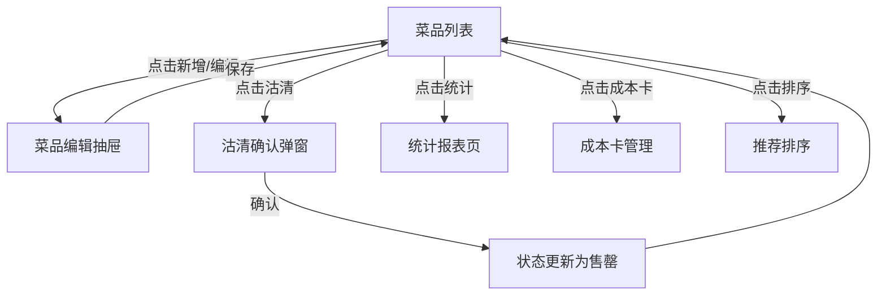

## 1. 产品概述

餐饮门店菜品上下架与沽清管理系统，为后厨人员和门店经理提供菜品全生命周期管理工具。支持菜品信息维护、上下架管理、沽清操作、定时上架、销量统计、成本核算与毛利分析，以及菜品推荐排序功能，帮助门店高效运营、降低损耗、提升利润。

## 2. 核心功能

### 2.1 用户角色

| 角色 | 登录方式 | 核心权限 |
|------|----------|----------|
| 后厨人员 | 账号登录 | 菜品信息维护、上下架操作、沽清管理、定时上架设置 |
| 门店经理 | 账号登录 | 全部后厨权限 + 销量统计查看、沽清记录查看、成本卡管理、推荐排序 |

### 2.2 功能模块

1. **菜品管理**：菜品列表、新增/编辑/删除菜品、分类管理、图片上传
2. **上下架管理**：一键上架/下架、上架状态显示
3. **沽清管理**：一键沽清/恢复、售罄状态标记
4. **定时上架**：设置定时上架时段、自动上架/下架
5. **销量统计**：当日销量排行、销量图表展示
6. **沽清记录**：沽清历史、恢复记录
7. **成本卡管理**：原材料录入、用量设置、自动计算毛利
8. **推荐排序**：手动置顶、拖拽排序

### 2.3 页面详情

| 页面名称 | 模块名称 | 功能描述 |
|----------|----------|----------|
| 菜品列表页 | 搜索筛选区 | 按分类、上架状态、沽清状态筛选菜品 |
| 菜品列表页 | 菜品卡片网格 | 展示菜品图片、名称、价格、状态标签、操作按钮 |
| 菜品列表页 | 快捷操作栏 | 批量上下架、批量沽清 |
| 菜品详情/编辑页 | 基础信息表单 | 名称、分类、价格、图片上传 |
| 菜品详情/编辑页 | 状态控制区 | 上架/下架、沽清/恢复按钮 |
| 菜品详情/编辑页 | 定时上架设置 | 设置开始/结束时间、重复周期 |
| 成本卡页 | 原材料列表 | 显示菜品所需原材料及用量 |
| 成本卡页 | 成本计算区 | 自动计算总成本、毛利率 |
| 统计报表页 | 销量统计 | 当日销量排行、分类销量占比 |
| 统计报表页 | 沽清记录 | 当日沽清历史、操作人、时间 |
| 推荐排序页 | 排序列表 | 拖拽调整顺序、置顶操作 |

## 3. 核心流程

### 3.1 菜品上架流程

后厨人员进入菜品列表 → 选择目标菜品 → 点击上架按钮 → 菜品状态变为"已上架" → 点餐端可见

### 3.2 沽清操作流程

后厨人员发现某菜品售罄 → 在菜品列表找到对应菜品 → 点击沽清按钮 → 菜品标记为"售罄" → 点餐端显示售罄状态 → 补餐后点击恢复按钮恢复售卖

### 3.3 定时上架流程

门店经理设置菜品定时上架 → 配置上架时间和下架时间 → 系统自动在指定时间执行上下架 → 操作记录存入沽清记录

### 3.4 毛利计算流程

录入菜品原材料及用量 → 录入各原材料单价 → 系统自动计算菜品总成本 → 根据售价计算毛利率 → 展示在成本卡页面

## 4. 用户界面设计

### 4.1 设计风格

- **主色调**：暖橙色系 (#FF6B35)，营造餐饮行业的温暖、活力氛围
- **辅助色**：深绿色 (#2D5016) 代表新鲜食材，深红色 (#C1121F) 代表警告/售罄
- **中性色**：暖灰色系，米白色背景，营造餐厅温馨感
- **按钮风格**：圆角中等（8px），悬停有微缩放和阴影效果
- **字体**：标题使用具有设计感的衬线字体，正文使用清晰易读的无衬线字体
- **布局风格**：卡片式布局，左侧导航 + 右侧内容区
- **图标风格**：线性图标，简洁现代

### 4.2 页面设计概览

| 页面名称 | 模块名称 | UI元素 |
|----------|----------|--------|
| 菜品列表页 | 顶部操作栏 | 搜索框、分类筛选Tab、状态筛选下拉、新增菜品按钮 |
| 菜品列表页 | 菜品卡片 | 图片、名称、分类标签、价格、状态徽章（上架/下架/沽清）、操作按钮组 |
| 菜品列表页 | 空状态 | 美食图标 + 提示文字 + 引导按钮 |
| 菜品编辑抽屉 | 表单区域 | 分组表单，左侧图片预览，右侧字段输入 |
| 菜品编辑抽屉 | 状态开关 | 上架开关、沽清开关，带状态文字说明 |
| 统计报表页 | 数据概览 | 四个数据卡片（总销量、总销售额、沽清次数、平均毛利） |
| 统计报表页 | 图表区域 | 销量柱状图、分类占比饼图 |
| 统计报表页 | 沽清记录列表 | 时间线样式展示沽清/恢复记录 |
| 成本卡页 | 原材料表格 | 可编辑表格，支持增删行 |
| 成本卡页 | 毛利卡片 | 突出显示毛利率，带颜色指示（高/中/低） |
| 推荐排序页 | 排序列表 | 可拖拽的菜品项，置顶按钮，序号显示 |

### 4.3 响应式设计

- 桌面端优先（1280px+），主要在门店电脑端使用
- 平板端（768px-1279px）：左侧导航收起为图标导航
- 移动端（<768px）：顶部导航栏，底部Tab切换，适合后厨手机操作
- 触摸优化：按钮最小高度44px，手势支持滑动操作

### 4.4 动效设计

- 页面切换：淡入淡出 + 轻微位移动画
- 菜品卡片：悬停时微微上浮 + 阴影加深
- 状态切换：平滑过渡动画，沽清时红色闪烁提示
- 数据加载：骨架屏加载动画
- 按钮交互：点击时缩放反馈
- 拖拽排序：拖拽时阴影放大，释放时弹性归位

