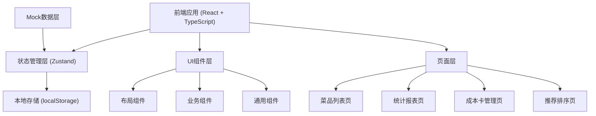
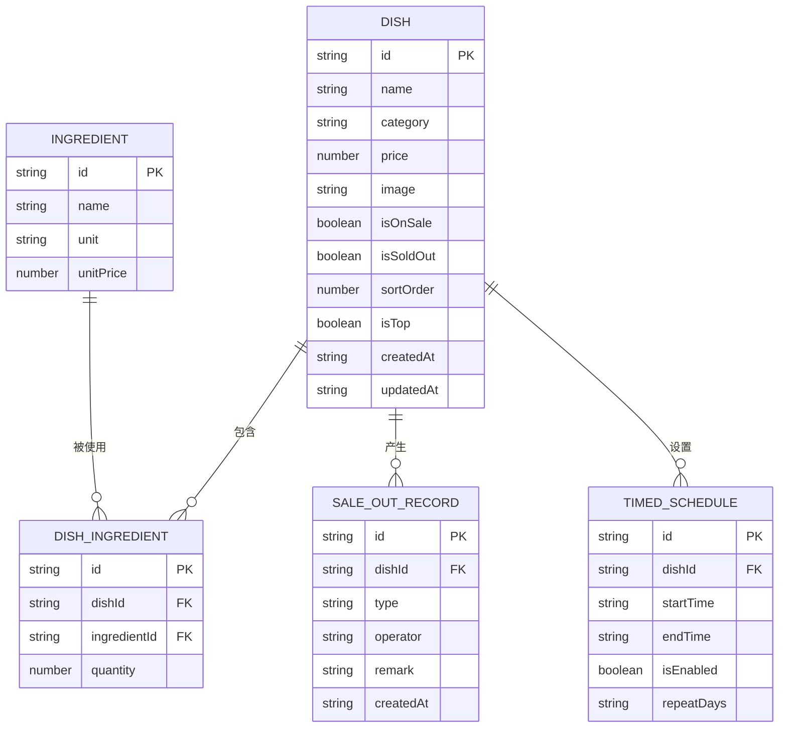

## 1. 架构设计



## 2. 技术描述

- **前端框架**: React@18 + TypeScript
- **构建工具**: Vite
- **样式方案**: Tailwind CSS@3
- **状态管理**: Zustand
- **路由**: react-router-dom
- **图标库**: lucide-react
- **图表库**: recharts
- **拖拽排序**: @dnd-kit/core + @dnd-kit/sortable
- **数据存储**: localStorage（前端持久化）
- **数据模拟**: Mock数据 + 本地存储

## 3. 路由定义

| 路由 | 页面名称 | 说明 |
|------|----------|------|
| /dishes | 菜品列表 | 菜品管理主页面，展示所有菜品及状态操作 |
| /statistics | 统计报表 | 销量统计和沽清记录 |
| /cost-cards | 成本卡管理 | 菜品成本卡与毛利计算 |
| /sorting | 推荐排序 | 菜品推荐排序与置顶 |

## 4. 数据模型

### 4.1 数据模型定义



### 4.2 数据类型定义

```typescript
// 菜品分类
type DishCategory = 'hot' | 'cold' | 'staple' | 'drink';

// 菜品
interface Dish {
  id: string;
  name: string;
  category: DishCategory;
  price: number;
  image: string;
  isOnSale: boolean;
  isSoldOut: boolean;
  sortOrder: number;
  isTop: boolean;
  description?: string;
  createdAt: string;
  updatedAt: string;
}

// 原材料
interface Ingredient {
  id: string;
  name: string;
  unit: string;
  unitPrice: number;
}

// 菜品成本卡
interface DishIngredient {
  id: string;
  dishId: string;
  ingredientId: string;
  quantity: number;
}

// 沽清记录
type RecordType = 'sold_out' | 'restored' | 'auto_on_sale' | 'auto_off_sale';

interface SaleOutRecord {
  id: string;
  dishId: string;
  type: RecordType;
  operator: string;
  remark?: string;
  createdAt: string;
}

// 定时上架
interface TimedSchedule {
  id: string;
  dishId: string;
  startTime: string;
  endTime: string;
  isEnabled: boolean;
  repeatDays: number[];
}

// 销量统计
interface SalesStats {
  dishId: string;
  dishName: string;
  quantity: number;
  amount: number;
}
```

## 5. 状态管理设计

### 5.1 Store 结构

```typescript
interface AppStore {
  // 菜品数据
  dishes: Dish[];
  ingredients: Ingredient[];
  dishIngredients: DishIngredient[];
  saleOutRecords: SaleOutRecord[];
  timedSchedules: TimedSchedule[];
  salesStats: SalesStats[];

  // 筛选状态
  filterCategory: DishCategory | 'all';
  filterStatus: 'all' | 'on_sale' | 'off_sale' | 'sold_out';
  searchKeyword: string;

  // 操作方法
  addDish: (dish: Omit<Dish, 'id' | 'createdAt' | 'updatedAt'>) => void;
  updateDish: (id: string, dish: Partial<Dish>) => void;
  deleteDish: (id: string) => void;
  toggleOnSale: (id: string) => void;
  toggleSoldOut: (id: string, operator: string, remark?: string) => void;
  setDishTop: (id: string, isTop: boolean) => void;
  updateDishSortOrder: (dishes: Dish[]) => void;
  
  addSaleOutRecord: (record: Omit<SaleOutRecord, 'id' | 'createdAt'>) => void;
  
  addIngredient: (ingredient: Omit<Ingredient, 'id'>) => void;
  updateIngredient: (id: string, ingredient: Partial<Ingredient>) => void;
  deleteIngredient: (id: string) => void;
  
  addDishIngredient: (item: Omit<DishIngredient, 'id'>) => void;
  updateDishIngredient: (id: string, item: Partial<DishIngredient>) => void;
  deleteDishIngredient: (id: string) => void;
  
  addTimedSchedule: (schedule: Omit<TimedSchedule, 'id'>) => void;
  updateTimedSchedule: (id: string, schedule: Partial<TimedSchedule>) => void;
  deleteTimedSchedule: (id: string) => void;
  checkTimedSchedules: () => void;

  setFilterCategory: (category: DishCategory | 'all') => void;
  setFilterStatus: (status: 'all' | 'on_sale' | 'off_sale' | 'sold_out') => void;
  setSearchKeyword: (keyword: string) => void;

  getFilteredDishes: () => Dish[];
  getDishById: (id: string) => Dish | undefined;
  getDishCost: (dishId: string) => number;
  getDishProfitRate: (dishId: string) => number;
  getTodaySaleOutRecords: () => SaleOutRecord[];
  getSalesStats: () => SalesStats[];
}
```

## 6. 项目结构

```
src/
├── components/          # 通用组件
│   ├── layout/         # 布局组件
│   │   ├── Sidebar.tsx
│   │   └── Header.tsx
│   ├── dish/           # 菜品相关组件
│   │   ├── DishCard.tsx
│   │   ├── DishForm.tsx
│   │   └── DishDrawer.tsx
│   ├── common/         # 通用UI组件
│   │   ├── Button.tsx
│   │   ├── Badge.tsx
│   │   ├── Modal.tsx
│   │   ├── Drawer.tsx
│   │   └── Empty.tsx
│   └── charts/         # 图表组件
│       ├── SalesBarChart.tsx
│       └── CategoryPieChart.tsx
├── pages/              # 页面组件
│   ├── DishList.tsx
│   ├── Statistics.tsx
│   ├── CostCards.tsx
│   └── Sorting.tsx
├── store/              # 状态管理
│   └── useAppStore.ts
├── types/              # 类型定义
│   └── index.ts
├── utils/              # 工具函数
│   ├── id.ts
│   ├── storage.ts
│   └── format.ts
├── data/               # Mock数据
│   └── mockData.ts
├── hooks/              # 自定义Hooks
│   ├── useTimedSchedule.ts
│   └── useLocalStorage.ts
├── App.tsx
├── main.tsx
└── index.css
```
